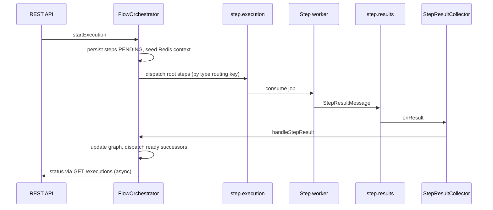

# Async API Orchestration Gateway

Backend service for composing API workflows as directed graphs of steps. The gateway persists flow definitions, triggers executions, and orchestrates work **asynchronously** through RabbitMQ. Each step type is consumed by dedicated workers; results return through a dedicated results exchange so the **FlowOrchestrator** can schedule dependent steps, handle retries with a TTL redelivery path, optional saga-style HTTP compensation, and expose live execution traces over STOMP WebSockets.

## Architecture

```
                    +-------------+
                    |   Client    |
                    +------+------+
                           | REST
                           v
+------------------+  +-----+------+   Redis (context + circuits)
|  FlowController  |->| FlowService |
+------------------+  +-----+------+
                           |
                           v
                 +---------+----------+
                 |  FlowOrchestrator  |<------------------+
                 +---------+----------+                   |
                           | publish                     |
                           v                              |
                 +---------+----------+         +---------+---------+
                 | Topic exchange     |         | Direct exchange   |
                 | step.execution     |         | step.results      |
                 +---------+----------+         +---------+---------+
                           |                              ^
        +------------------+------------------+----------+
        |                  |                  |
        v                  v                  v
  +-----------+     +-----------+     +-----------+
  | HTTP q    |     | Transform | ... | Script q  |
  +-----+-----+     +-----+-----+     +-----+-----+
        |                  |                  |
        +------------------+------------------+
                           | result messages
                           v
                 +---------+----------+
                 | StepResultCollector |
                 +---------+----------+
                           |
              +------------+-------------+
              | orchestrate next / done  |
              | WebSocket + fanout trace |
              +--------------------------+
```

## Orchestration sequence



## RabbitMQ topology

| Exchange           | Type   | Purpose |
|--------------------|--------|---------|
| `step.execution`   | topic  | Route work to per-type queues (`step.http`, `step.transform`, …) |
| `step.results`     | direct | Workers publish outcomes with routing key `result` |
| `step.retry`       | direct | Failed attempts republished here, bound to TTL queue |
| `step.retry.ttl`   | queue  | 5s TTL; dead-letters to `step.redelivery` fanout |
| `step.redelivery`  | fanout | Listener reads `gw-target-rk` header, republishes to `step.execution` |
| `gateway.dlx`      | direct | Worker queue DLX; route `dead` → `step.dlq` |
| `execution.events` | fanout | JSON trace events for external consumers |
| `step.result.queue`| queue  | Bound to `step.results` / `result` |

Per-type queues: `step.http.queue`, `step.transform.queue`, `step.condition.queue`, `step.delay.queue`, `step.aggregate.queue`, `step.script.queue`.

## Step types

| Type        | Role | Config highlights |
|-------------|------|-------------------|
| `HTTP_CALL` | WebClient outbound call | `url`, `method`, `headers`, `body`, `extractors` (JsonPath → map) |
| `TRANSFORM` | Map / SpEL | `mappings`: output key → expression or `input.field` path |
| `CONDITION` | Branch | `condition` (SpEL, `#input`), `onTrue` / `onFalse` step ids |
| `DELAY`     | Backoff | `delayMs` (capped in worker) |
| `AGGREGATE` | Fan-in | `waitFor` step ids, `strategy`: `merge` or nest by step id |
| `SCRIPT`    | Placeholder | `language`, `code` — simulated response |

## Circuit breaker (Redis)

States: **CLOSED → OPEN** after more than 5 failures for the same normalized endpoint key; OPEN for 30s then eligible for **HALF_OPEN** probing. Success from HALF_OPEN returns to **CLOSED**. The `CircuitBreakerController` exposes read and reset operations.

## Saga / compensation

When a step exhausts retries and defines `compensationConfig` (e.g. `url`, `method`), `FlowOrchestrator.startCompensation` runs completed steps in reverse order, issues blocking HTTP calls, marks steps `COMPENSATING` / `COMPENSATED`, then sets the flow `FAILED`.

## System design notes

- **Correlation**: `executionId` (string) plus JPA UUID primary key tie messages, Redis context (`gw:ctx:{executionId}`), and WebSocket topic `/topic/executions/{executionId}`.
- **Topic routing**: Workers bind to fixed routing keys (`step.http`, …) so orchestration stays decoupled from queue names.
- **Circuit state**: Redis hashes under `gw:cb:*` with an index set for enumeration.
- **Saga**: Reverse-order compensation with explicit HTTP semantics; extend with dedicated compensation workers if non-HTTP actions are required.
- **Back-pressure**: Listener container `prefetchCount=10`, bounded concurrency per queue (HTTP `concurrency=3`).
- **Fan-out / fan-in**: Graph edges fan out; `AGGREGATE` merges prior step outputs from Redis context.

## API examples

Base URL: `http://localhost:8082`

Create flow:

```bash
curl -s -X POST http://localhost:8082/api/v1/flows \
  -H "Content-Type: application/json" \
  -d '{"name":"demo","description":"d","flowDefinition":{"steps":[{"stepId":"s1","name":"Call","type":"HTTP_CALL","config":{"url":"https://httpbin.org/get","method":"GET"}}],"edges":[]}}'
```

Activate and trigger:

```bash
curl -s -X POST http://localhost:8082/api/v1/flows/{id}/activate
curl -s -X POST http://localhost:8082/api/v1/flows/{id}/trigger \
  -H "Content-Type: application/json" \
  -d '{"inputData":{"orderId":"42"},"correlationId":"corr-1"}'
```

Validate only:

```bash
curl -s -X POST http://localhost:8082/api/v1/flows/validate \
  -H "Content-Type: application/json" \
  -d '{"steps":[...],"edges":[...]}'
```

List executions and stats:

```bash
curl -s "http://localhost:8082/api/v1/executions?page=0&size=20"
curl -s http://localhost:8082/api/v1/executions/stats
```

Swagger UI: `http://localhost:8082/swagger-ui.html`  
OpenAPI JSON: `http://localhost:8082/api-docs`

## How to run

**Docker Compose (recommended)**

```bash
docker compose up --build
```

**Local JVM** (PostgreSQL, RabbitMQ, Redis on localhost):

```bash
export SPRING_DATASOURCE_URL=jdbc:postgresql://localhost:5432/gateway_db
export SPRING_RABBITMQ_HOST=localhost
export SPRING_DATA_REDIS_HOST=localhost
mvn -pl gateway-service spring-boot:run
```

## Future enhancements

- JWT-scoped `createdBy` and tenant isolation  
- Persistent delayed retries (vs fixed TTL queue)  
- Dedicated compensation step type and async saga completion  
- JSON Schema validation for `inputSchema`  
- OAuth2-protected WebSocket handshake  
- Metrics per step type and DLQ replay tooling  

---

Built with Java 17+, Spring Boot 3.2.x, Maven multi-module (`common`, `gateway-service`), Lombok 1.18.42 (pinned in parent `dependencyManagement` and compiler annotation processor paths).
